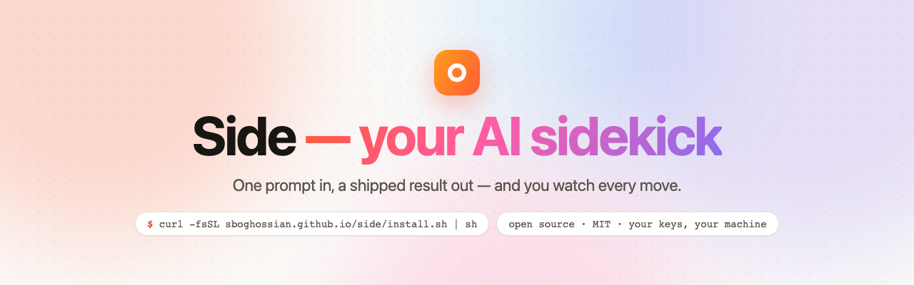
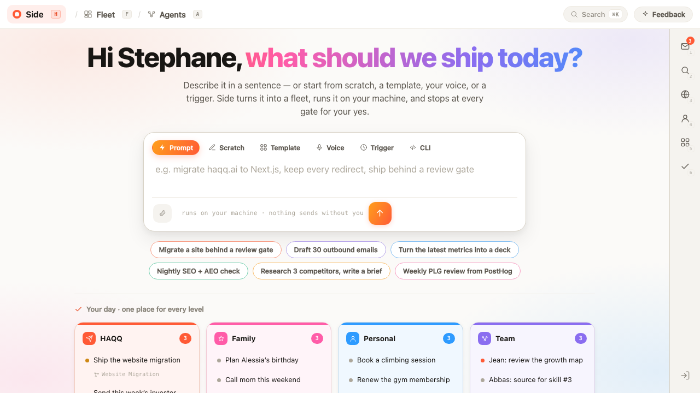
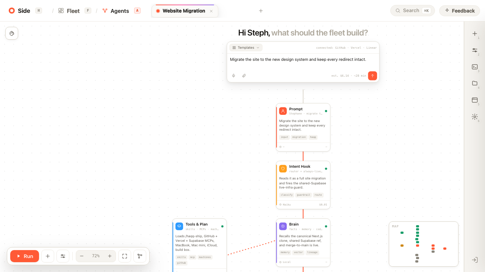
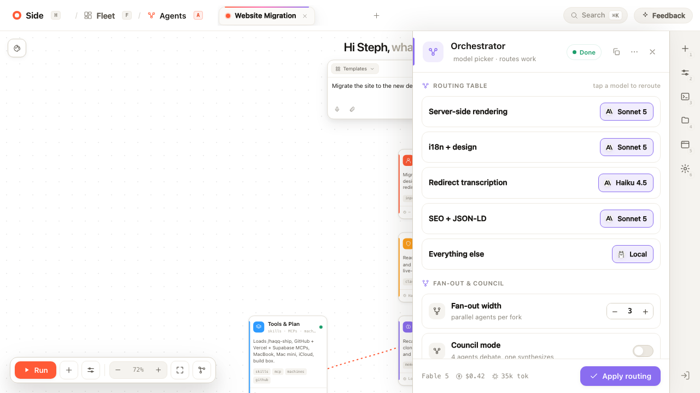
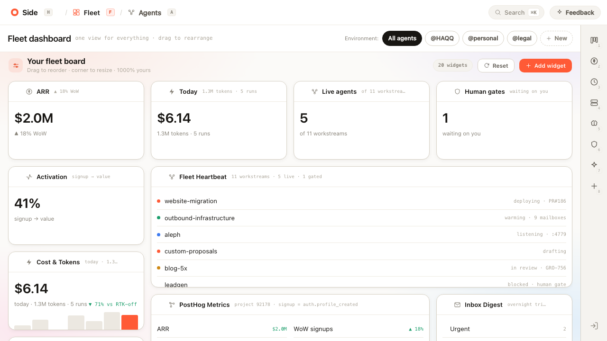
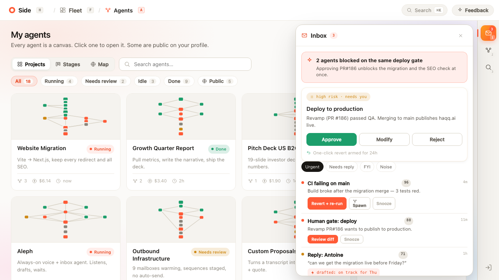
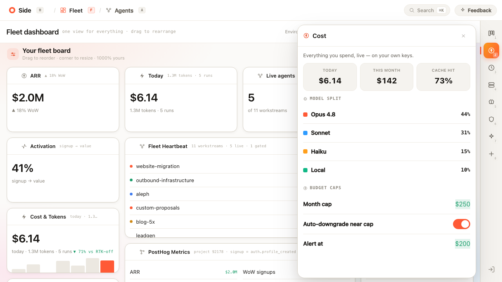
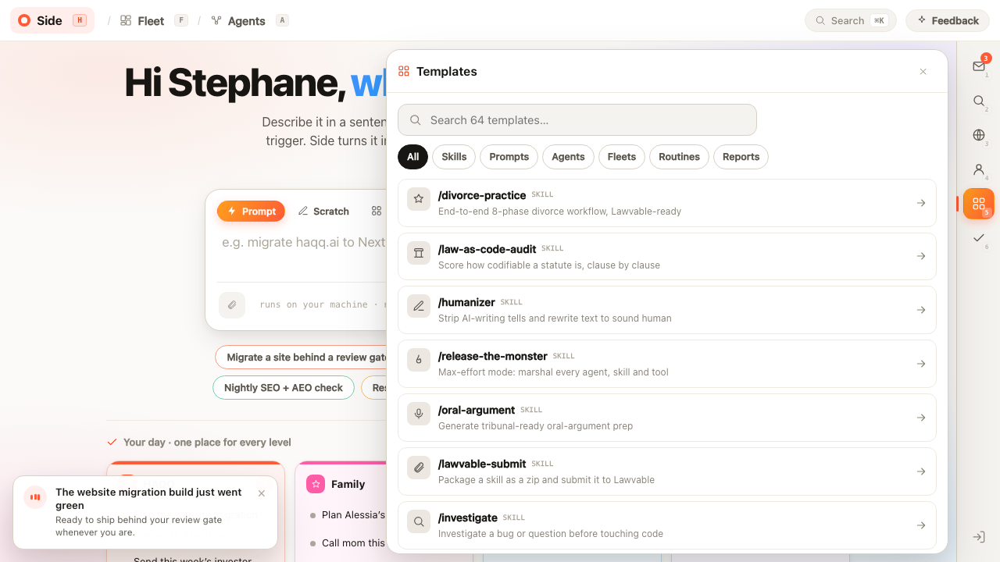
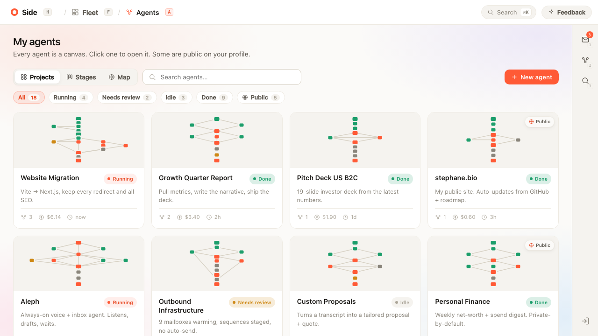
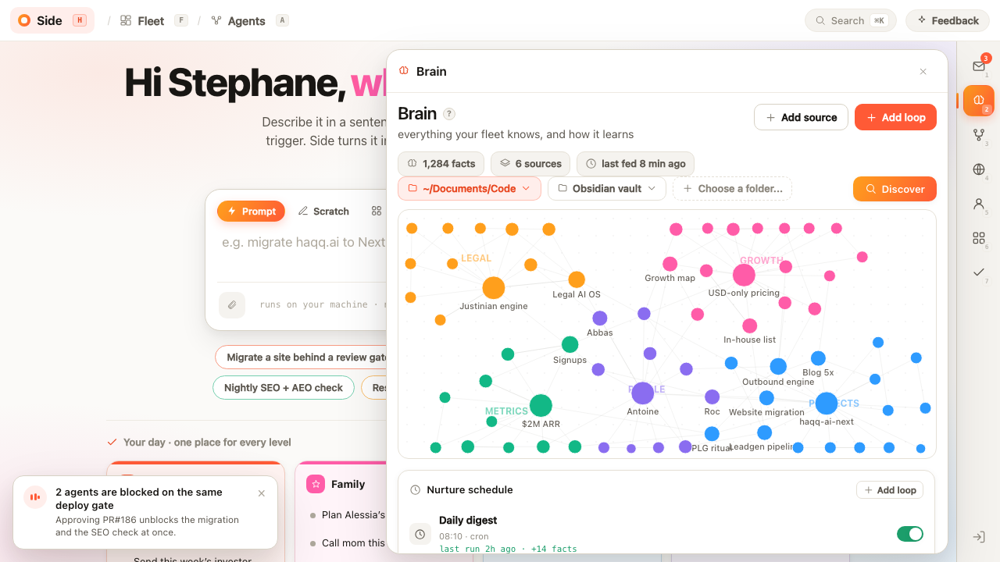

<div align="center">



[](LICENSE)
[](app/index.html)
[](#under-the-hood)
[](CONTRIBUTING.md)

**[▶ Try it in your browser right now](https://sboghossian.github.io/side/app/)** — no install needed.

</div>

## Up and running in three steps

| | | |
|---|---|---|
| **1 · Install** | `curl -fsSL sboghossian.github.io/side/install.sh \| sh` | one command, zero dependencies |
| **2 · Open** | `side` | a desktop window opens on `localhost:4600` — already yours |
| **3 · Plug in** | paste **any model key** | ~30 seconds; or skip it and explore the demo |

Nothing leaves your computer. Your key lives in your browser and talks to exactly one place: your model's API.

---

## Why

99% of people don't code. And most people who *use* AI every day still can't see how it works. You can chat with a model, but you never see how agents think, how they plan, or how they work together. So people either trust AI blindly or stay a little scared of it.

Side is the missing picture: hand it one plain-English prompt and **watch** a fleet of agents plan, split the work, route each task to the right model, stop at your approval gates, and ship the result. Think **n8n for the AI age** — built so you learn by watching, not reading.

## What you get

### 🏠 Start with a sentence

Type what you want — a website migration, an outbound campaign, a deck. Or start from a template, your voice, a trigger, or the CLI. Side shows you the plan first: the goal, the steps, the agents, **and the cost — before anything runs.**



### 🎨 A canvas, not a black box

Two projections of the same fleet: **Flow** (default) — a fast, structured vertical view with side-by-side lanes, inline renaming, and no zoom to fight — and **Map**, the full 2D canvas with pan, zoom and minimap for the spatial view. One toggle switches them; runs animate in whichever you're in.



### 🧠 Route every task to the right model

Open any node. The orchestrator sends server-side rendering to one model, i18n to another, transcription to the cheapest one that clears the bar — and anything private to a local model. You can override every row.



### 📊 A fleet board you own

ARR, spend, live agents, human gates, heartbeat — every widget draggable, resizable, closable. It's your mission control, 1000% customizable.



### 🛡️ Nothing irreversible without your yes

Sends, merges, deploys, payments — everything risky stops at a human gate and lands in one inbox. Approve, modify, or reject, with one-click revert armed for 24 hours.



### 💸 Every token, live — and capped

It runs on **your** API keys, so you see real spend as it happens: model split, cache hits, budget caps, auto-downgrade before you blow the budget.



### ⚡ 64 templates, or save your own

Never start from a blank page. Run a template, love the result, save the whole fleet as a one-click Skill.



### 🎛️ Click a node, enter its world

Every node opens as a full workspace: a live conversation with that agent on the right — its work and thinking stream in while the fleet runs, and you can probe or steer it mid-run — and a freeform canvas on the left where everything is a component: notes, follow-up prompts, diagrams, tasks, artifacts, previews, the terminal, per-node settings. Press `/` or `+ Add` and compose the page your way. It all persists.

### 🌳 A decision tree you control

Every prompt flows through a global pipeline before a fleet is built: check the Brain, classify the ask, route it down the right lane — code builds discover the codebase first, outbound hits a hard no-auto-send gate, research gets a cite-check. The whole tree is yours: toggle steps, edit lanes, add branches, change the keywords that route to them. Press `⌘K → Decision tree`.

### 🚢 Every agent is a canvas

Your whole fleet at a glance — running, gated, done — each with a live thumbnail of its graph, plus an isometric **city map** where every agent is a building in its district. Some public on your profile, most private on your machine.



### 🧠 A brain in your sidebar

Everything your fleet knows, and how it learns — one rail icon away. Point Side at a folder and **watch it discover**: an Obsidian-style force graph streams in node by node, clustered by topic. Next to it, the **nurture schedule** — the loops that feed your brain (daily digests, session archives, weekly retros), each with its last run and how many facts it added — plus your sources' health and a live feed of what was just learned. Agents ground on this instead of guessing.



### 🎓 It teaches you as you use it

Side assumes you've never touched agent tooling. A 60-second tour runs once after onboarding (replay it anytime with `?`). Every core concept — fleet, agent, gate, run, brain, decision tree — has a plain-language definition one `?` dot or `⌘K → Learn Side` away, and every empty screen explains the concept it's waiting to hold. You learn by watching; the product narrates.

### 🔎 Search reaches the ecosystem

Template search doesn't stop at what's installed: matching open-source components — MCP servers, skills, community fleets — appear under **"From the ecosystem"** with one-click install. A preview of where Side is going (see the roadmap: the v0.8 engine speaks MCP).

## How it works

```
you describe it → Side plans the fleet → the fleet runs → it stops at your gate → shipped
```

1. **You describe it** — plain words in one box. No setup.
2. **Side plans the fleet** — the goal becomes real steps, each step an agent on the canvas.
3. **The fleet runs** — every agent in parallel, on your machine, with your keys.
4. **It stops at your gate** — nothing irreversible without your yes.
5. **Shipped — and saved** — the real thing, done. Save it as a Skill and run it again in one click.

## Install

```sh
curl -fsSL sboghossian.github.io/side/install.sh | sh
```

Then:

| command | what it does |
|---|---|
| `side` | launch Side (serves `localhost:4600`, opens a desktop window) |
| `side update` | pull the latest app |
| `side reset` | relaunch with a fresh profile (replays onboarding) |
| `side --version` | print version |

Configuration takes about 30 seconds and asks exactly three things: your name, a few sentences of context your agents read before every run, and **any model key** — Claude runs live today; GPT, Gemini and local (Ollama) plug into the v0.8 engine, and your pick is remembered. Paste a key and Side is real; skip it and you get the safe demo sandbox.

**Uninstall:** `rm -rf ~/.side ~/.local/bin/side` — that's everything.

## Under the hood

- **One self-contained HTML file.** The entire product — canvas, fleet board, inbox, cost, templates, onboarding, command palette — is a single zero-dependency file. No build step, no node_modules, no framework.
- **Local-first by design.** The launcher is ~80 lines of POSIX sh plus a stdlib-only Python daemon on `127.0.0.1` — it serves the app and writes your shipped artifacts under `~/Side/`, and nothing else. Your keys, your files, your machine.
- **A desktop app without the desktop-app tax.** `side` opens a chromeless app window if you have any Chromium browser, and falls back to your default browser. No Electron, no 200MB runtime.
- Press `⌘K` anywhere. Everything is reachable from the keyboard.

## The real engine (v0.2)

Bring your own Anthropic API key — paste it in onboarding, or press `⌘K → Set API key` anytime — and Side stops simulating:

- **Real plans.** Your prompt goes to Claude; the fleet on the canvas is the plan it returns.
- **Real runs.** Every node is a real Claude call — brain, tools, orchestrator, then the sub-agents in parallel, then a converge pass that writes the final deliverable.
- **Real numbers.** Tokens and cost in the shipped report come from actual API usage.
- **Real artifacts.** After you approve the gate, the deliverable is written to `~/Side/runs/<fleet>/result.md` on your disk by the local daemon.

Your key lives in your browser's local storage and is sent to exactly one place: `api.anthropic.com`. No key? Everything runs as the safe simulation — same product, demo fuel.

## The agent tier — read + plan (v0.8 alpha)

Have [Claude Code](https://claude.com/claude-code) installed and logged in? Side detects it and a fleet's nodes stop *describing* work and start **reading your real world** to propose it. When a node runs, the `side` daemon spawns a headless Claude Code process that:

- runs **read-only** — limited to read tools (`Read`, `Grep`, `Glob`); no write, edit, or shell tool is available, so it *cannot* modify anything even if asked (we tested it adversarially — it won't),
- works inside a **throwaway sandbox** (`~/Side/runs/<fleet>/workspace`), never your wider disk,
- uses **your existing Claude Code login** — no separate API key,
- and hands its **proposal to your gate**. Nothing is applied. You read what it would do and approve.

This is deliberately the *read-and-propose* half. Letting an approved node actually apply edits — one gated action at a time — is the next milestone, behind its own approval. The promise holds either way: **nothing irreversible without your yes.**

No Claude Code? The tier is simply off and Side behaves exactly as before (browser-direct engine with a key, or the demo sim).

## Status & roadmap

- [x] The whole experience: canvas, routing, fleet board, gates, cost, templates, onboarding, ⌘K
- [x] One-command install + desktop launcher
- [x] **Real runs: bring-your-own-key engine** — browser-direct Anthropic calls, per-node model routing, parallel sub-agents
- [x] **Real artifacts on disk** — the `side` daemon writes shipped results under `~/Side/`
- [x] **Real mode** — with a key, Side is *your* workspace: your name, your agents, your runs and spend, persisted across launches. The demo data only exists in demo mode
- [x] **The decision tree** — a user-configurable global pipeline (recall → classify → route → gate policy) that governs how every fleet is composed, in demo and real runs alike
- [x] **Flow view** — the canvas's structured default projection: document-fast, lanes side-by-side, edit inline; the 2D Map stays one toggle away
- [x] **The node designer** — click any node for a full workspace: live session chat (streams during runs, probe mid-run) + a freeform component canvas (notes, prompts, diagrams, tasks, artifacts, terminal, settings), persisted per node
- [x] **The Brain** — a living knowledge graph in your sidebar: folder discovery, nurture loops, sources, learnings
- [x] **Learn-as-you-go** — first-run tour, plain-language glossary (`⌘K → Learn Side`), educational empty states
- [x] **Ecosystem search (preview)** — template search surfaces installable open-source components
- [x] **v0.8 alpha — the agent tier (read + plan).** With Claude Code installed, a fleet's nodes read your real files and propose work through a headless, read-only, sandboxed process; the proposal lands at your gate (see [The agent tier](#the-agent-tier--read--plan-v08-alpha) above)
- [ ] **v0.8 beta — the acting tier.** Let an approved node apply edits, one gated action at a time (per-action permission bridge)
- [ ] **MCP client.** Real tools (GitHub, Gmail, PostHog, Linear, a browser…) via the open Model Context Protocol, durable/resumable runs, multi-provider keys (GPT, Gemini, local)
- [ ] Skills: export/import a fleet as a shareable one-click Skill
- [ ] Side World: public profiles + leaderboard

If that roadmap excites you — [come build it](CONTRIBUTING.md).

## Contributing

The whole product is one HTML file: open [`app/index.html`](app/index.html), edit, refresh. See [CONTRIBUTING.md](CONTRIBUTING.md) for the three rules that keep it that simple.

## License

[MIT](LICENSE) — do whatever you want with it.

---

<div align="center">

*Made for people who want to **control** AI instead of being rushed along by it.*

</div>
